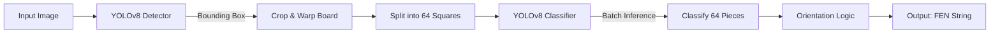

# ♟️ Chess Vision: AI-Powered FEN Generator

A **computer vision** pipeline that converts **chessboard images** (screenshots or photos) into **digital FEN strings** using a **2-Stage YOLOv8 pipeline**.  
The system detects the board, classifies pieces with high precision, handles **board orientation automatically**, and integrates directly with **Lichess** for analysis.


---

# Table of Contents

1. [🚀 Why This Matters](#why-this-matters)  
2. [🏗️ Model Architecture](#model-architecture)
3. [📁 Project Structure](#project-structure)
4. [📊 Key Features](#key-features)  
5. [🔧 How It Works](#how-it-works)   
6. [🛠️ Requirements](#requirements)
7. [▶️ Quick Start](#quick-start)
8. [👤 Author](#author)  

---

## 🚀 Why This Matters <a name="why-this-matters"></a>
Bridging the gap between physical (or video) chess and digital engines is a classic computer vision challenge.  
This project demonstrates an **End-to-End AI Pipeline** that solves real-world constraints such as **perspective distortion**, **orientation detection** (White vs. Black), and **piece recognition**.

You’ll see how to:
- Chain multiple **YOLOv8 models** (Detection + Classification) effectively.
- Use **OpenCV** for perspective warping and grid slicing.
- Deploy a Deep Learning model via a **FastAPI** web interface.
- Generate valid **FEN (Forsyth–Edwards Notation)** strings programmatically.

---

## 🏗️ Model Architecture <a name="model-architecture"></a>


The pipeline consists of two distinct Deep Learning models:
1.  **Board Detector:** Locates the chessboard and crops it.
2.  **Piece Classifier:** Identifies the piece (or empty square) in each of the 64 grid cells.

---

## 📁 Project Structure <a name="project-structure"></a>
```
├── app/                  # Web Application logic
│   ├── static/           # Logos and generated images
│   └── apmain.py         # FastAPI Backend
├── models/               # Trained YOLOv8 Weights
│   ├── board_best.pt     # Model 1: Board Detector
│   └── piece_best.pt     # Model 2: Piece Classifier
├── templates/            # HTML Frontend
│   ├── index.html        # Upload Page
│   └── result.html       # Results & Lichess Link
├── dataset_tools/        # Scripts for data prep
│   ├── harvest_pieces.py # Extract pieces from raw data
│   └── split_data.py     # Train/Val splitter
├── main.py               # Core CLI Pipeline
├── train_pieces.py       # Training script
├── requirements.txt      # Dependencies
└── README.md             # Documentation
```
---

## 📊 Key Features <a name="key-features"></a>

| Feature | Description |
|:---|:---|
| **2-Stage Pipeline** | Decoupling detection from classification ensures higher accuracy on smaller pieces. |
| **Smart Orientation** 🧠 | Automatically detects if the board is flipped (Black at bottom) and adjusts FEN accordingly. |
| **Web Interface** 🌐 | Modern FastAPI dashboard to upload images and view results instantly. |
| **Lichess Integration** ♟️ | One-click button to open the scanned position directly in the Lichess Analysis Board. |
| **Data Tools** 🚜 | Included scripts to harvest, clean, and split datasets for custom training. |

---

## 🔧 How It Works <a name="how-it-works"></a>

### 1. Board Localization
The first YOLO model scans the full image to find the chessboard boundaries. It applies a **perspective transform** to flatten the board into a perfect 640x640 square.

### 2. The "Grid Split"
The flattened board is mathematically sliced into an 8x8 grid. Each of the 64 squares is treated as a separate image.

### 3. Classification & FEN Construction
The second YOLO model (Classifier) predicts the content of each square (e.g., `WK` for White King, `empty` for blank).  
- **Logic:** The system converts these class names into FEN characters (e.g., `WK` -> `K`, `BP` -> `p`).
- **Compression:** Consecutive empty squares are compressed (e.g., `1, 1, 1` -> `3`).

---

## 🛠️ Requirements <a name="requirements"></a>

- Python 3.10+
- Ultralytics (YOLOv8)
- FastAPI & Uvicorn
- OpenCV (cv2)
- NumPy

---

## ▶️ Quick Start <a name="quick-start"></a>

### 1. Clone the Repository
```
git clone https://github.com/Demerdashh/chess-vision-fen.git
cd chess-vision-fen
```
### 2. Install Dependencies
```
pip install -r requirements.txt
```

### 3. Run the Web App
```
uvicorn app.apmain:app --reload
```
### 4. Run via Command Line (CLI)
Process a specific image without the web server:
```
python main.py --input "path/to/your/image.jpg" --visualize
```

---

## 👤 Author <a name="author"></a>
Built with ❤️ by **Youssef El Demerdash** 
* [LinkedIn](https://www.linkedin.com/in/youssef-eldemerdash-754674378/)  
* [GitHub](https://github.com/Demerdashh)
