# ♟️ Chess Vision: AI-Powered FEN Generator

A **computer vision** pipeline that converts **chessboard images** into valid **FEN strings** using a **two-stage YOLOv8 pipeline** — deployed as a containerized FastAPI web application.

The system detects the board, classifies all 64 squares, handles **orientation automatically**, and links directly to **Lichess** for instant analysis.


---

## 📋 Table of Contents

1. [Why This Matters](#-why-this-matters)
2. [Model Architecture](#-model-architecture)
3. [Key Features](#-key-features)
4. [How It Works](#-how-it-works)
5. [Project Structure](#-project-structure)
6. [Tech Stack](#-tech-stack)
7. [Running with Docker](#-running-with-docker) (**Recommended**)
8. [Local Quick Start](#-local-quick-start)
9. [Author](#-author)

---

## 🚀 Why This Matters

Bridging the gap between physical (or video) chess and digital engines is a classic computer vision challenge. This project demonstrates an **end-to-end AI pipeline** that solves real-world constraints: **perspective distortion**, **automatic orientation detection** (White vs. Black at bottom), and **piece recognition across 13 classes**.

Key engineering decisions demonstrated:

- Chaining two **YOLOv8 models** (detection + classification) in a single inference pipeline
- **Perspective warping** with OpenCV to normalize any camera angle
- **FEN compression logic** for valid, engine-readable output
- Production deployment via **FastAPI + Uvicorn** inside a Docker container
- **CPU-only inference** — runs without any GPU inside the container

---

## 🏗️ Model Architecture <a name="-model-architecture"></a>



```mermaid
flowchart LR
    A[Input Image] --> B[YOLOv8 Board Detector]
    B -- Bounding Box --> C[Perspective Warp & Crop]
    C --> D[Split into 64 Squares]
    D --> E[YOLOv8 Piece Classifier]
    E -- 13-class Batch Inference --> F[Piece Labels per Square]
    F --> G[Orientation Logic]
    G --> H[FEN String Output]
    H --> I[Lichess Analysis Link]
```

**Stage 1 — Board Detector:** Locates the chessboard in the raw image and returns a bounding box.  
**Stage 2 — Piece Classifier:** Receives 64 cropped squares and classifies each (e.g. `WK`, `BP`, `empty`).

---

## 📊 Key Features

| Feature                    | Description                                                                                |
| :------------------------- | :----------------------------------------------------------------------------------------- |
| **2-Stage YOLO Pipeline**  | Decoupling detection from classification improves accuracy on small, densely packed pieces |
| **Smart Orientation** 🧠   | Detects whether the board is flipped (Black at bottom) and adjusts FEN output accordingly  |
| **Web Interface** 🌐       | FastAPI dashboard to upload images and view results instantly in the browser               |
| **Lichess Integration** ♟️ | One-click button opens the scanned position directly in the Lichess Analysis Board         |
| **Docker Deployment** 🐳   | Full containerization — runs identically on any machine with zero environment setup        |
| **CPU Inference** ⚡       | CPU-only PyTorch build keeps the image lean (~400 MB vs ~2 GB with CUDA)                   |
| **Data Tools** 🚜          | Included scripts to harvest, clean, and split datasets for custom retraining               |

---

## 🔧 How It Works

### 1. Board Localization

The first YOLO model scans the full input image to detect the chessboard boundaries. A **perspective transform** flattens the board into a normalized 640×640 square, correcting any camera angle or distortion.

### 2. Grid Split

The warped board is mathematically divided into an 8×8 grid. Each of the 64 squares is extracted as an independent image crop.

### 3. Classification & FEN Construction

The second YOLO model classifies each square across 13 classes (`WK`, `WQ`, `WR`, `WB`, `WN`, `WP`, `BK`, `BQ`, `BR`, `BB`, `BN`, `BP`, `empty`).

- Class names are mapped to FEN characters (`WK` → `K`, `BP` → `p`)
- Consecutive empty squares are compressed (`1,1,1` → `3`)
- Row separator `/` is inserted between ranks
- Final string is validated before being embedded in the Lichess URL

---

## 📁 Project Structure

```
chess-vision-fen/
│
├── app/                        # Web application layer
│   ├── static/                 # Logos and generated result images
│   └── apmain.py               # FastAPI backend — routes & inference calls
│
├── models/                     # Trained YOLOv8 weights (tracked in Git)
│   ├── board_best.pt           # Stage 1: Board detector weights
│   └── piece_best.pt           # Stage 2: Piece classifier weights
│
├── templates/                  # Jinja2 HTML templates
│   ├── index.html              # Upload page
│   └── result.html             # FEN result & Lichess link
│
├── dataset_tools/              # Offline data preparation scripts
│   ├── harvest_pieces.py       # Extract piece crops from raw annotated data
│   └── split_data.py          # Train / validation splitter
│
├── main.py                     # Core pipeline logic (shared by CLI & FastAPI)
├── train_pieces.py             # Training script for the piece classifier
│
├── Dockerfile                  # Container build — python:3.11-slim, CPU torch
├── docker-compose.yml          # One-command deployment with healthcheck
├── .dockerignore               # Excludes datasets, cache, and training artifacts
│
├── requirements.txt            # Python dependencies
└── README.md
```

---

## 🛠️ Tech Stack <a name="-tech-stack"></a>

| Layer                     | Technology                       |
| :------------------------ | :------------------------------- |
| **Language**              | Python 3.11                      |
| **Object Detection**      | Ultralytics YOLOv8               |
| **Image Processing**      | OpenCV (`opencv-contrib-python`) |
| **Numerics**              | NumPy                            |
| **Web Framework**         | FastAPI                          |
| **ASGI Server**           | Uvicorn                          |
| **Deep Learning Runtime** | PyTorch (CPU build)              |
| **Containerization**      | Docker + Docker Compose          |

---

## 🐳 Running with Docker

The entire application is containerized. **No local Python environment or GPU required.**

### Prerequisites

[Docker Desktop](https://www.docker.com/products/docker-desktop/) installed and running.

### One-Command Start

```bash
git clone https://github.com/Demerdashh/chess-vision-fen.git
cd chess-vision-fen

docker compose up --build
```

Open **http://localhost:8000** in your browser.

> **First build** downloads ~400 MB of dependencies (CPU PyTorch + OpenCV). Subsequent runs use Docker's layer cache and start in seconds.

### Container Details

| Property       | Value                      |
| :------------- | :------------------------- |
| Base image     | `python:3.11-slim`         |
| PyTorch build  | CPU-only — no CUDA drivers |
| Exposed port   | `8000`                     |
| Health check   | `GET /docs` every 30s      |
| Restart policy | `unless-stopped`           |

### Useful Commands

```bash
# Run in background
docker compose up -d

# View live logs
docker compose logs -f

# Stop
docker compose down

# Force rebuild after code changes
docker compose up --build
```

---

## ▶️ Local Quick Start <a name="-local-quick-start"></a>

If you prefer running without Docker:

### 1. Clone & Install

```bash
git clone https://github.com/Demerdashh/chess-vision-fen.git
cd chess-vision-fen
pip install -r requirements.txt
```

### 2. Run the Web App

```bash
uvicorn app.apmain:app --reload
```

Open **http://localhost:8000**.

### 3. Run via CLI

Process a single image without the web server:

```bash
python main.py --input "path/to/your/image.jpg" --visualize
```

---

## 👤 Author

Built by **Youssef El Demerdash**

[](https://www.linkedin.com/in/youssef-eldemerdash-754674378/)
[](https://github.com/Demerdashh)
